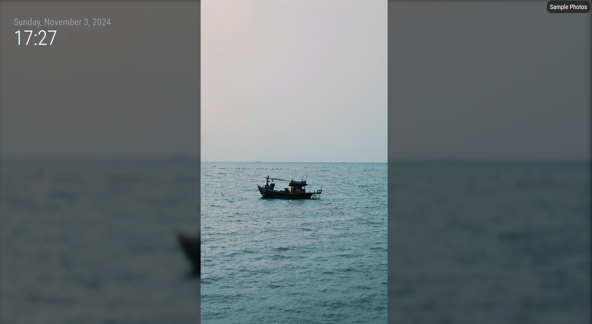
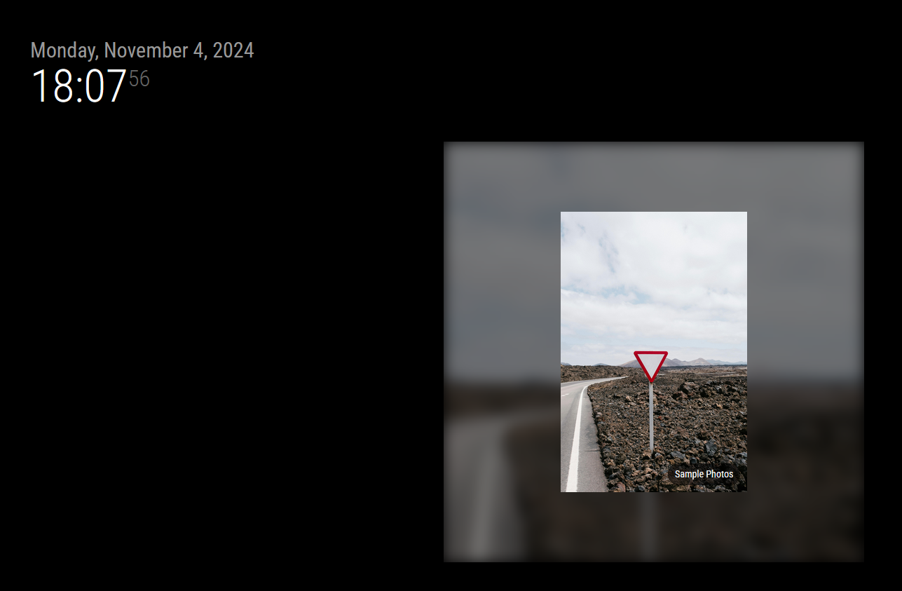

# MMM-S3Photos

A MagicMirror² module that displays photos and videos from an AWS S3 bucket with various display options and automatic synchronization.

This module was created as a result of Google Photos crippling their API and limiting how you can access your own data. While AWS is not free like Google Photos, it does provide a more open and flexible platform for storing and accessing your photos and videos. And if configured properly, can be very inexpensive to run. My set up has a monthly cost of ~$0.60 thats not a typo 60 CENTS! if you are on the free tier it will be even cheaper. see cost breakdown for more details.

This is under active development so some minor quirks should be expected. will do my best to fix them as they are reported.
See the docs folder for more details on configuration options and other details.



(absolute mode)



## Buy me a coffee
I'm a overworked, and underpaid, tech worker in the analytics and intelligence industry. I spend my free time creating and sharing side projects like MagicMirror modules and 3D printing STL files with the community. If you enjoy my work and want to support future projects, buy me a coffee! ☕

[Buy me a coffee](https://buymeacoffee.com/uphillcheddar)

## Features
- **Automated AWS Infrastructure Setup**
  - Script handles creating S3 bucket, Lambda function, and related invocation roles.
- **Video and Photo Support**
  - Supports common video formats: MP4, WebM, OGG, MOV, AVI, MKV, M4V
  - Supports image formats: JPG, JPEG, PNG, GIF, WebP, BMP, SVG
  - Configurable video options (autoplay, loop, mute, controls)
  - Optional videos-only mode for testing or dedicated video displays
- **Configurable display duration**
   - Minimum 10 seconds recommended
- **Multiple display styles:**
  - Wallpaper (full screen)
  - Fit-region (maintains aspect ratio)
  - Absolute (fixed size)
- **Optional blur effect for empty space**
- **Multiple display order options:**
  - Random 
  - Random with deduplication <- displays all media once before repeating
  - Newest first
  - Oldest first
- **Optional attribution overlay with configurable positioning**
  - Static (fixed position)
  - Dynamic (random position)
- **Photo/Video upload from USB storage device**
   - Script based uploads to S3 bucket, maintains folder structure.
   - Safely ejects USB device
- **Optional selfieshot uploads from MMM-Selfieshot**
   - Uploads selfies taken from the MMM-Selfieshot module to S3 bucket.
- **Delta Updates**: 
   - Only downloads new or modified media, reducing bandwidth usage
- **Configurable Cache Lifetime**: 
   - Set `cacheLifeDays: 0` for permanent cache
   - Set `cacheLifeDays: N` to automatically purge cache every N days < -- NOT RECOMMENDED!! (due to increase data transfer cost.)

## Uploading files to S3
 There are a couple options for uploading files to S3. (and by extension to your MagicMirror²)
 - 1. Included in this module is a utility script to copy files to the cache folder and upload them to the S3 bucket. See [USB Upload Instructions](docs/usb_uploads.md) for more details.
 - 2. Manually upload files to the S3 bucket using the AWS console (Website UI).
 - 3. Use the AWS CLI to upload files to the S3 bucket. The user and access keys that are created as part of the setup script have the necessary permissions to directly upload files to the S3 bucket. You can pair this something like onedrive or dropbox and a simple cronjob to automatically sync your photos and videos to the S3 bucket.
 - 4. If you are looking for a more hands off app like experience, there are a number of 3rd party apps that allow you to sync photos to an S3 bucket. I dont specifically endorse these but they seem to be popular:  [immich](https://immich.app/) , [photosync](https://www.photosync-app.com/home)
 - 5. if you are up for more of a technical approach you can set up a SNS topic and Amazon SES and simply email photos/videos as attachments to your s3 bucket. 

# AWS Costs
This module uses AWS services that may incur charges.

Example details:
- 10GB of photos
- Hourly sync requests 
- No cache wipes <-this one is important, wiping the cache is the bigest potental cost driver. Note there should be no reason to wipe the cache as the module will prune photos that have been deleted from the S3 bucket, but if your use case involves photos with the same file name and a need to regularly purge the cache feature is available.

**NOTE Prices are for the US regions as of 10-2024 Other regions may vary. Check [AWS Pricing](https://aws.amazon.com/pricing/) for current rates in your region.**

## Breakdown for the free tier:

### S3 Storage
- First 5GB per month: FREE
- $0.023 per GB/month after first 5GB (5 x $0.023)
- S3 Total~$0.35/month

### Lambda Function
- First 1 million requests per month: FREE
- 128MB memory allocation
- Typically runs once per hour = ~720 requests/month
- Lambda total $0.00/month FREE!

### Data Transfer
- 10GB (each photo transfered once)
   - Module only downloads new/modified photos (delta updates) so this usage is only incured once per photo unless you wipe the cache.
- 100GB transfer included in free tier 
- Total $0.00/month: FREE!

## Grand Total- For most users, on the aws free tier, this module will cost ~$.30 Cents per month.

## No free tier?
 The cost will be about the same as the free tier on a monthly basis. Howwever the first month will be ~$1.00 as you will not have the advantage of the free tier data transfer. So the inital load will hit you for about 40 cents. But after that you will only pay about $0.60 per month. (lambda remains free at such a low use)
 
 


## To Do / Wish List / On the Back Burner
* ~~Video support~~ ✅ **COMPLETED** [(Thanks @finkj !)](https://github.com/uphillcheddar/MMM-S3Photos/pull/2) - Now supports Videos with hardware-accelerated playback. Tested on Raspberry Pi 5
* Date based sorting to use exif data when availble (instead of file modification date)

# Installation instructions
 * ssh into raspberry pi
 * go to MagicMirror² modules folder
   ```bash
   cd ~/MagicMirror/modules
   ```
 * clone the repository
   ```bash
   git clone https://github.com/uphillcheddar/MMM-S3Photos.git
   ```
 * create aws account and setup IAM user and access key see [AWS Account Creation Steps](docs/aws_account_creation_steps.md)
 * go to the module directory
   ```bash
   cd ~/MagicMirror/modules/MMM-S3Photos
   ```
 * install dependencies
   ```bash
   npm install
   ```
 * run setup script - be patient this can take a while (0-10 minutes depending on aws region).
   ```bash
   # The script will make sure that you have aws cli and aws cdk installed. if not, it will ask if you want them installed (choosing no cancels setup)
   cd ~/MagicMirror/modules/MMM-S3Photos
   sudo node ./setup.js
   ```
* ! After Setup is complete return to aws console and reduce permissions of the IAM user (a template for permissions is generated by the setup script that can be used to reduce permissions)


## Troubleshooting

### Node.js Runtime Update (Important for updating users)

This module was originally written when Node.js 20.x was supported. As of version 1.10, it now uses Node.js 24.x.

**Existing Users:**
If you followed the recommendation and locked down the user that this module uses, then the AWS credentials will not allow re-deployment of the CDK. You will need to manually update the Lambda runtime:
1. Go to the [AWS Console](https://console.aws.amazon.com/lambda/).
2. Find your Lambda function (usually named something like `S3PhotosStack-S3PhotosHandler...`).
3. In the "Runtime settings" section, click "Edit".
4. Change the Runtime to **Node.js 24.x** (or any other currently supported version).
5. Click "Save".

Alternatively, if you would rather have the CDK deploy it for you: you can find your MagicMirror user in the AWS Console, give it admin rights (like you did during setup), and then use the CDK CLI to redeploy. It will handle everything for you, but I HIGHLY recommend lowering/removing the permissions back down to only the S3 bucket and Lambda invocations after the update.

**New Users:**
You should be fine using the default setup until 2028 (the EOL date for Node.js 24).

### Common Issues

**No photos displayed on initial load**

On first load (immediately after boot), the module connects to Lambda to request a full manifest of files that should be in the local cache, then downloads any missing files. If you have a large library and this is your first time running the module, expect it to take several minutes to complete the initial download — this is normal.

Subsequent (differential) updates run silently in the background and should have no noticeable delay. However, if you power off the MagicMirror and make large changes to your S3 library while it is off, you may see a similar delay on the next boot while the module re-syncs the cache.

**Clock hard to read**

Add this to your ~/MagicMirror/css/custom.css file:
```css
.clock {
  padding: 10px;
  background-color: rgba(0, 0, 0, 0.5);
}
```

**Permission Errors**
   ```bash
   sudo chmod 755 ~/MagicMirror/modules/MMM-S3Photos/cache
   sudo chmod 644 ~/MagicMirror/modules/MMM-S3Photos/cache/photos.json
   ```

**AWS Credentials**
   - Verify credentials in `local_aws-credentials` or run setup.js again and chose not to use existing credentials. (this will create a new credential file)
   - Ensure IAM user has appropriate permissions

**Photo Loading**
   - Check network connectivity
   - Verify S3 bucket permissions
   - Review module logs in MagicMirror console

**Video Playback Issues**
   - Ensure video files are in supported formats (MP4, WebM, OGG recommended)
   - Check that videos are not too large (hardware limitations on Raspberry Pi)
   - For stuttering videos, try reducing video resolution or bitrate
   - Enable hardware acceleration in Chromium: `--enable-features=VaapiVideoDecoder`


## Contributing

Pull requests are welcome. For major changes, please open an issue first to discuss proposed changes.

## License

[MIT](LICENSE)


